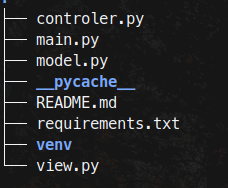

# POSTMateRest

## _Una app simple para testear tus APIs_

Buscando una alternativa más sencilla a **POSTman** para probar mis APIs, tuve la 
idea de crear la mía propia, basada en mis necesidades. Lo que realmente 
quería era algo simple y sin complicaciones: solo ingresar los endpoints y 
los parámetros, y que funcione. Así nació la idea de **POSTMateRest**

---
### Funciones
- GET
- POST 
- PUT

- (falta feature de test)
